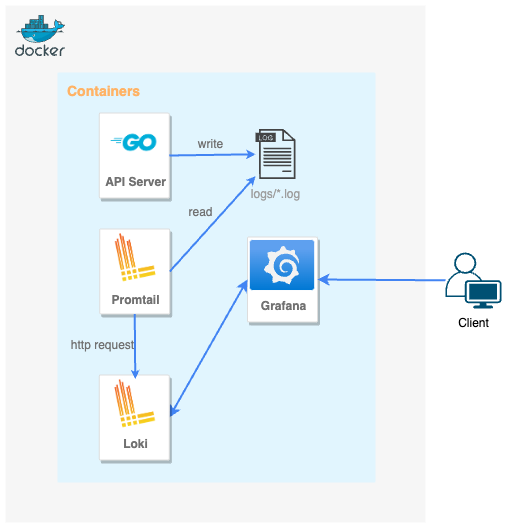
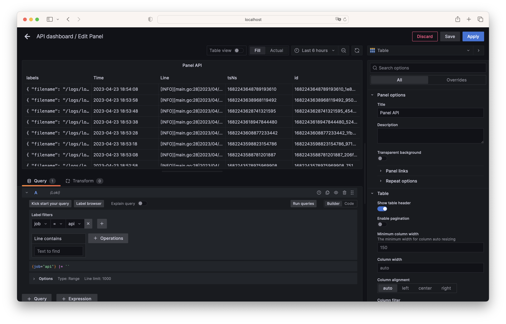
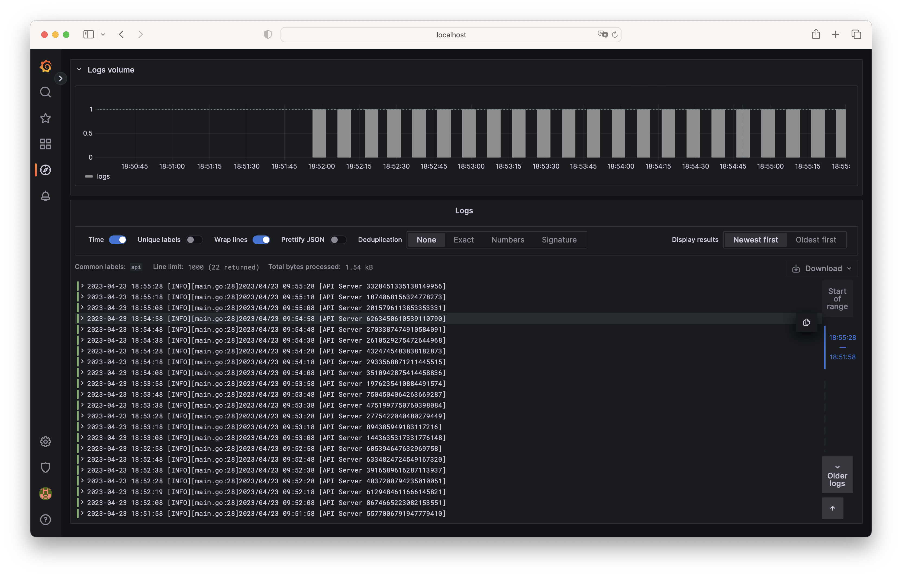
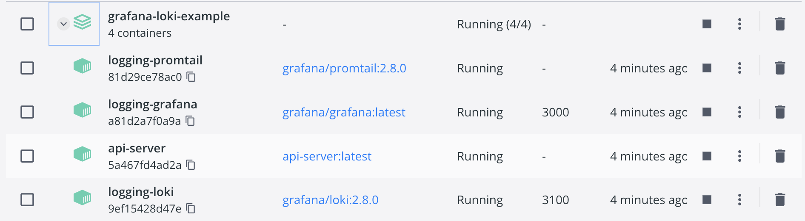

# grafana-loki-example

An example logging system using Grafana Loki.

<h3 align="center">

</h3>

## Usage

### Docker

```
// start
$ cd grafana-loki-example
$ docker-compose up -d

// stop
$ docker-compose stop
```

### Grafana WebPage

```
http://localhost:3000
User: admin
Pass: admin
```

## ScreenShot






## Container

* `server` - Log files are saved to `./server/logs`
* `loki` - Store logs received from Promtail.
* `promtail` - Collect string data from log files and send to Loki.
* `grafana` - Visualize data from Loki.

## Grafana Data Sources

- Loki: `http://loki:3100`